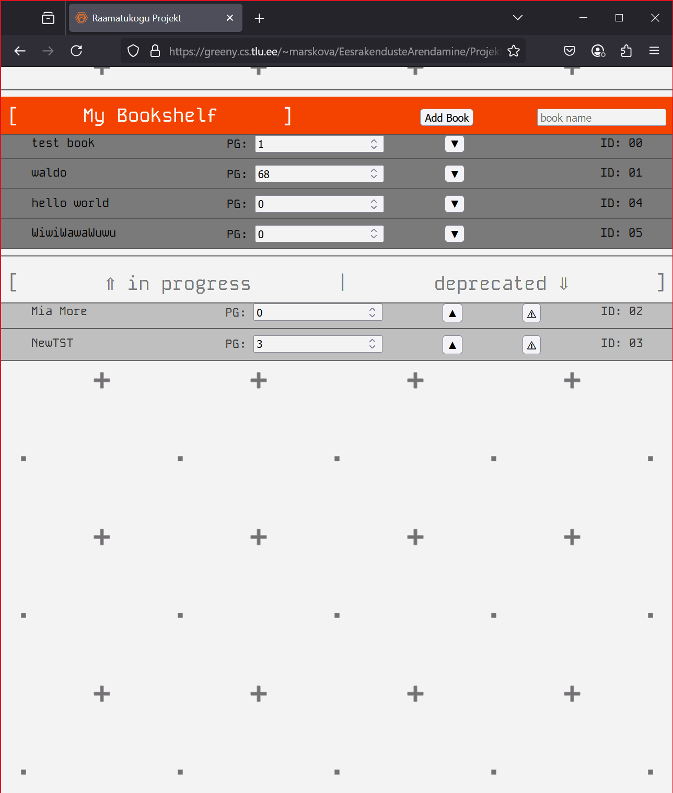

# Eesrakenduste Projekt: Raamatukogu
Tegi Marsell Kovalev

## Funktsionaalsus:
Projekti idee võetud kasutusele otse ülesannest mis on lingitud all,
( https://github.com/eesrakendused-2025/projekt )

-Rakendus võimaldab lisada uusi raamatuid, ning dünaamiliselt sätestada nende lehekülje, kus lugemine on jäetud.

-On eraldi loetelu raamatute jaoks, mis enam palju huvi ei paku, kas või juba loetud, või lihtsalt igavad.

-Kirjeid, mis on ebahuvitavate raamatute seas saab ka ära kustutada, aktiivsed raamatud täiesti on kustutamatud!

## Kuvatõmmis rakendusest:
NB! Pilt on tehtud HDR ekraanil, seega osa detailidest jäävad nähtamatuks.

